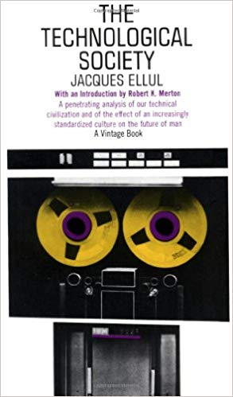

# A Sociedade Tecnologica

A Sociedade Tecnologica é um livro do escritor francês Jacques Ellul de 1954. Ellul se debruça sobre o fenomeno da tecnologia na sociedade moderna com o intuito de descrever como esta funciona e como ela impacta a vida e a liberdade humana. Para Ellul a liberdade humana é o direito mais essencial, partindo disso ele analisa os efeitos da Tecnologia desde a idade média até os dias atuais. Um relato tenebroso.

1. [Caso Facebook](./references/Facebook.md)