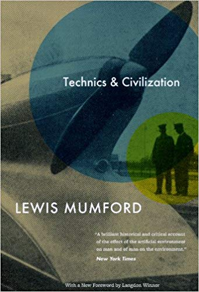

# Technics and Civilization

Jacques Ellul cita a todo momento no **The Technological Society** o livro de Lewis Mumford **Technics and Civilization** (_1934_). Com esse intuito estou preparando um resumo do livro.

## A Preparação Cultural

### Maquinas, Utilitários e "A Máquina"

A primeira questão que devemos responder é: **O que é a máquina?**

Das respostas encontradas na literatura, essa a mais abrangente é a de Franz Reuleaux:

> Uma máquina é uma combinação de corpos resistentes, dispostos de modo que, por seus meios, as forças mecânicas da natureza possam ser compelidas a realizar trabalhos acompanhados de certos movimentos determinantes. - **Franz Reuleaux**.

Apesar de clássica, essa definição não é completa. Devemos diferenciar **Máquina** de **Ferramenta**. Essa diferença entre os dois termos se dá no grau de automatismo que cada um tem. Uma máquina tem a função de executar uma tarefa especifica, ela pode ou não ter intervenção humana. Já a ferramenta é feita para expandir a capacidade humana, a atividade continuará sendo realizada pelo homem, a ferramenta apenas auxilia.

A máquina é a evolução natural da ferramenta. A ferramenta permitiu ao homem se adaptar a ambientes adversos. Por exemplo, ao inves de desenvolver adaptações fisiologicas para o frio, o homem desenvolveu roupas.

### O Monastério e o Relógio

Até a Idade Média o homem era regido por eventos, esses eventos eram relativos ao próprio corpo humano ou ao ambiente. Fome, sono, época de chuvas e colheitas. A Idade das Máquinas se inicia quando surge um modo de se quantificar exatamente o tempo. O Rélogio, e não o motor a vapor, é a máquina chave da era industrial moderna. O Relógio não é meramente uma ferramenta para medida sistemática do tempo, mas uma ferramenta de sincronização das ações humanas. 

A experiência humana não é mais uma sucessão de eventos, mas uma coleção de horas onde os eventos acontecem e são catalogados. Nós podemos criar ferramentas para medir o tempo e economizar horas. Com o advento do motor e dos novos meios de locomoção, o tempo pode ser acelerado. O tempo é dinheiro.